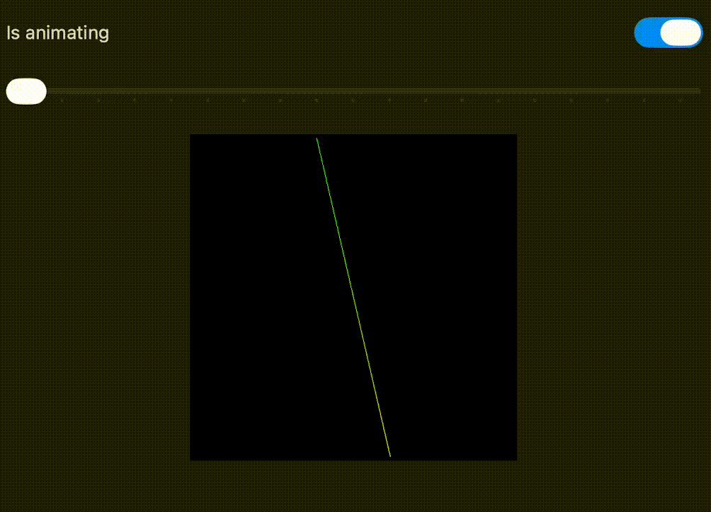

# SwiftUI: Render View (Geometry) With Metal 4

A demo of rendering and animating geometries with metal 4.

For details and points to pay attention to, please check out my blog [SwiftUI: Render/Animate Geometries With Metal 4](https://medium.com/@itsuki.enjoy/swiftui-render-animate-geometries-with-metal-4-e41b2d3347d1)

